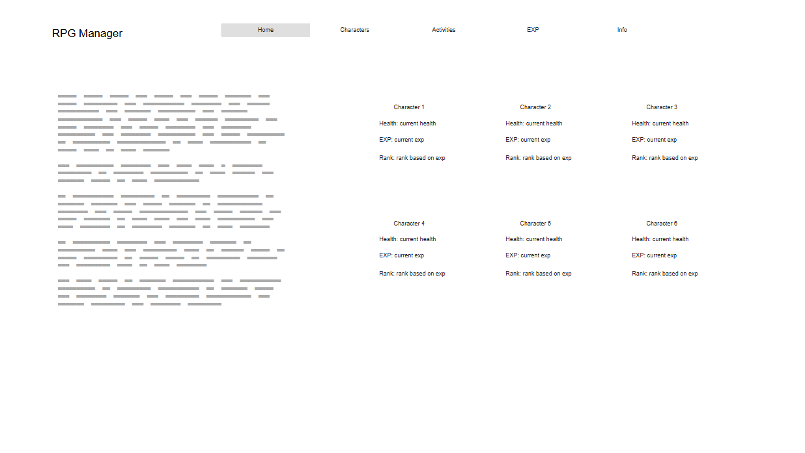

# Web Dev Starter Code

## Project Spec

What is the general theme?
- The theme is based around a set of admin tools for an ARPG (art role play game). This would generally include random number logic for rolling 
activities and the ability to track and manage characters (characters
in ARPGs are generally of a specific fantasy or made up animal species). In the case of this site (as I might actually use this beyond this class) I plan to make "generic" (with some simple assumptions taken) tools. EXP calculators, item rollers, exp grant option, etc. 

What is it going to do? 
- It will give admins (people who help run the game), tools to better do their job. Some tools will include the ability to create, edit or delete characters; The ability to give characters an amount of exp (points gained from art in this context) and have it add up to the total of a character's exp. Change a character's health status based on if the character is injured. and more

Who is the target audience? 
- The target audience would be mostly for a specific set of people. Each ARPG has unique functions and rolling numbers so it would be designed for either generic use (for all arpgs) or for a specific arpg team. In this case I am going as generic as I can; but for certain rng functions each group will differ in how they treat those so some assumptions are taken. For example, when making a simple activity roller with some items, the weight of the rarities that can be rolled must be assumed.

What sort of data will it manage? 
- Character data. This includes name, health status, exp total and maybe total items held. The health status could be used to influence how good rolls are for activities, or the site could calculate a rank based on the amount of exp a character has and display that. Exp would be a running total, where each time the "grant exp" function is used (on whatever page) it is added to the total rather than changing it. 
There may be several pre-determined health conditions, for example: Healthy, injured, sick, passed out, etc. This could be added to a dropdown to keep the data consistent. 

Stretch Goals? 
- A lot of the features I want are tough to do with AWS, but if I were to move this to a traditional PHP database setup; I would love to add things such as player banks (where different items in different categories can be stored). 
- With AWS; I think adding an "owner" field to character data to sort by who plays the character would be fun. A page could be used to show a library of characters based on who owns them.
- The ability to add character images; Im not entirely sure if AWS supports such a function for free so might not be possible with AWS.
- This is one im most interested in achieving... I would like to add a possible password lock to some pages. Some arpg teams (I know this as I help one) have certain tasks where those rolling numbers are top secret even in the team, only certain people can know them. So adding a password access to the page would be ideal. Creating a script that can handle a password securely is an interesting challenge I wish to try (Ive done it in php before but without such a complex set up its different)

## Project Wireframe

This is only the index page, because many of the side pages are very similar or something ive not thought the look of for yet. But the index page can have a small welcome or info blurb and all characters listed with their info. I want this info listed pretty and not in a table.

